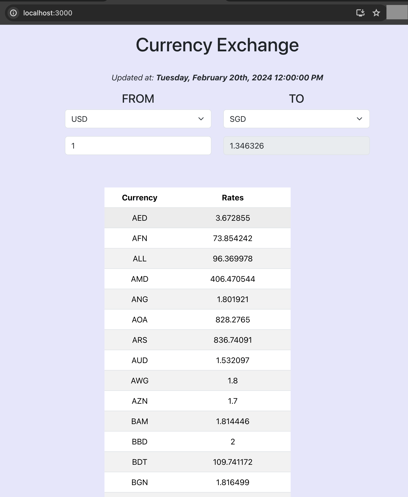
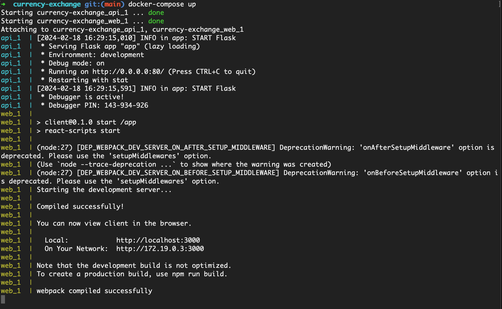

## Currency Exchange application

This repo is my exercise learning about containerization. Building a docker-compose for a currency converter using Python API and ReactJs frontend.

Currency Exchange data are pulled from https://openexchangerates.org.

<figure>
    
</figure>

---
### How to run

#### Run front and backend seperately

**Python(flask app) is used for backend APIs.**

```
cd flask_app/
./run_docker.sh
```

**React app is used for frontend.**
- node@14.19.0
- react@16.14.0
- Enzyme + Jest are used for testing.

```
cd frontend/
./run_docker.sh
```

#### Run frontend and backend parallel

Docker Compose build
```
docker-compose build
docket-compose up
```

[OR]

Docker Compose build and run, (if there were any changes in docker config, rebuild also same command)
```
docker-compose up --build
```

<figure>
    <figcaption>Application ports should be running on docker</figcaption>
    
</figure>


Browse Backend API: http://localhost:8000/exchange_rate

Browse Frontend: http://localhost:3000
